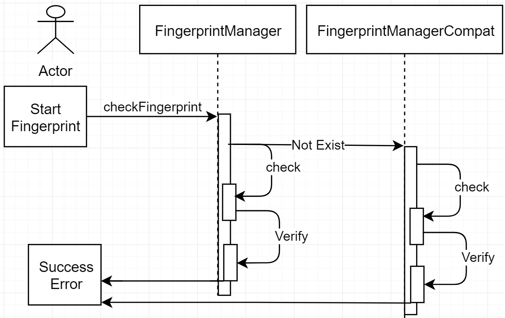

# About
This plugin was created referencing the [cordova-plugin-android-fingerprint-auth](https://github.com/mjwheatley/cordova-plugin-android-fingerprint-auth).  
Added FingerprintCompat class, compat with made-in-china cellphone and it's android version was Andrid M (API 23).

Manufactor:  
[Letv](http://www.lemall.com/phone.html)  
Huawei(Android 6.0)

Sequence Diagram:
